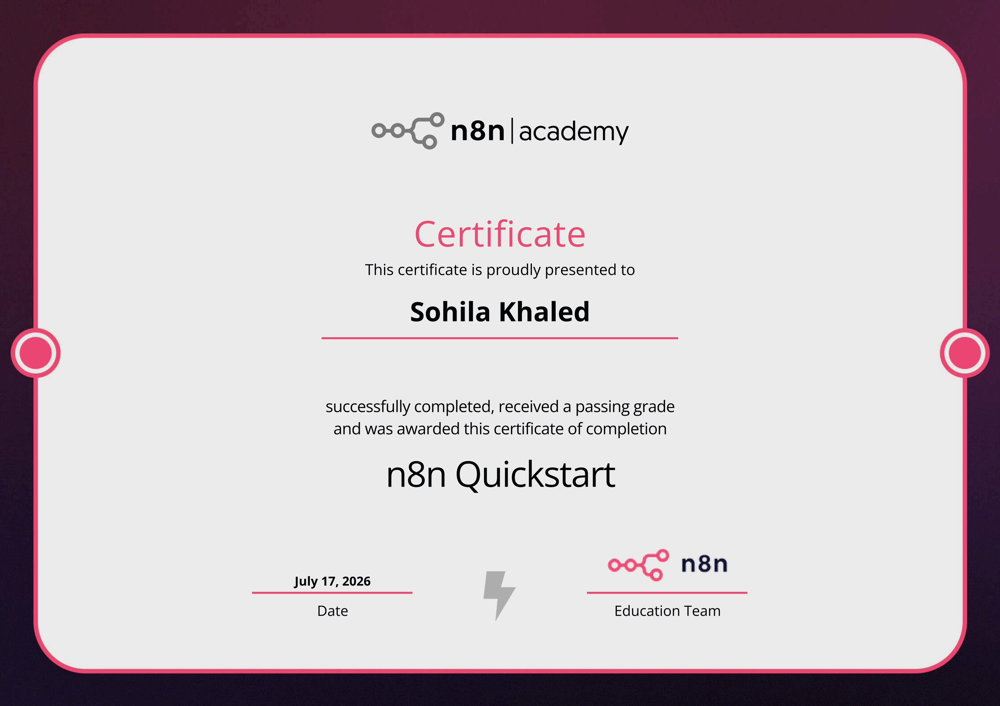
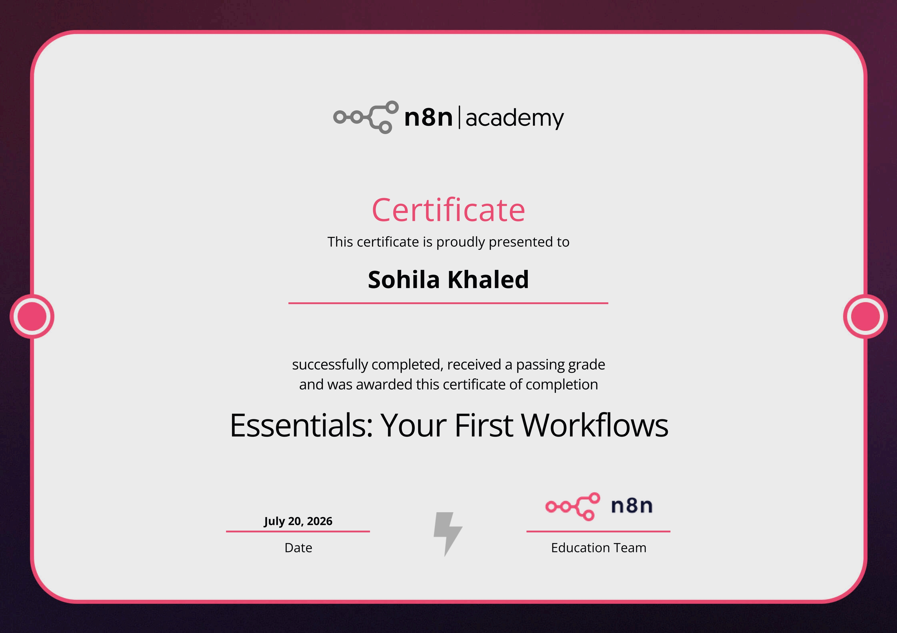
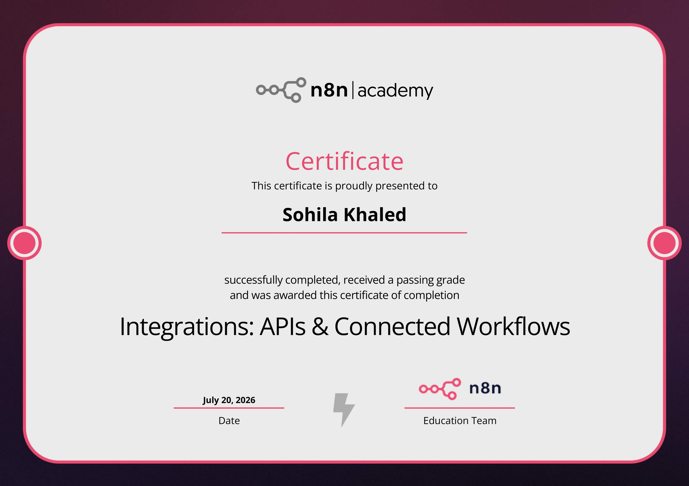

# 💼 Production n8n Workflow Portfolio

This portfolio contains **74 production-grade automation workflows**. These workflows solve real-world problems by integrating LLMs, vector databases (Qdrant, Supabase PgVector), relational databases (MSSQL, PostgreSQL), CRM platforms, and interactive interfaces (Telegram, Gmail, Google Sheets).

> [!TIP]
> **Intelligent Tagging System:** All workflows in this repository have been programmatically tagged using a "software engineering mentality". When you import these workflows into n8n, you'll see advanced architectural tags like **`Data Pipeline`**, **`Event-Driven Architecture`**, **`RAG`**, **`Agentic AI`**, and **`Orchestration`** automatically applied to them based on their internal node structure.

---

## 🎓 n8n Academy Certifications

This portfolio is backed by official certifications from the n8n Academy:

  
  
  

- **n8n Quickstart** (Completed July 17, 2026)
- **Essentials: Your First Workflows** (Completed July 20, 2026)
- **Integrations: APIs & Connected Workflows** (Completed July 20, 2026)

*(Certificates are available in the `docs/certificates/` directory.)*

---

## 📂 Table of Contents
1. [AI Chatbots & Conversational Commerce](#1--ai-chatbots--conversational-commerce)
2. [Lead Generation & CRM Automation](#2--lead-generation--crm-automation)
3. [Productivity & Content ETL Pipelines](#3--productivity--content-etl-pipelines)
4. [Utility & Core Concept Workflows](#4--utility--core-concept-workflows)
5. [How to Import and Run Workflows](#5--how-to-import-and-run-workflows)

---

## 1 💬 AI Chatbots & Conversational Commerce

### 🍽️ Gourmet Bistro Customer Service
* **Workflow File:** [Gourmet Bistro Customer Service.json](file:///d:/courses/Data%20Science/Data%20Engineering/n8n/workflows/Gourmet%20Bistro%20Customer%20Service.json)
* **Standalone Showcase Repo:** [n8n-workflow-gourmet-bistro-customer-service](published_repos/n8n-workflow-gourmet-bistro-customer-service) | [GitHub Link](https://github.com/Sohila-Khaled-Abbas/n8n-workflow-gourmet-bistro-customer-service)
* **Business Case:** Automates customer service and order management for a high-end restaurant. It uses a **multi-agent LangChain structure** to route messages to appropriate roles:
  * **Front Desk:** Welcomes guests and handles generic pleasantries.
  * **Menu & FAQ Expert:** Utilizes Qdrant/Supabase RAG vector search to answer menu, allergen, and opening hours questions.
  * **Order Creation Specialist:** Parses natural language orders, queries a Google Sheets database for pricing, calculates subtotals/totals, and persists draft orders in Supabase.
  * **Order Cancellation Specialist:** Inspects cancellation eligibility (enforces a strict 5-minute grace period) and modifies order status.
  * **Kitchen Dispatcher:** Generates real-time Telegram alerts for kitchen staff once address and Egyptian phone number validation passes.
  * **Human Escalation:** Triggers manager alerts via Telegram if a customer complains or requests a human.
* **Business Value:** Enforces business logic (delivery checks, grace periods, phone validation) while reducing front-of-house customer service load by up to **80%**.

### 🍕 Delivery Telegram Bot
* **Workflow File:** [Delivery Telegram Bot.json](file:///d:/courses/Data%20Science/Data%20Engineering/n8n/workflows/Delivery%20Telegram%20Bot.json)
* **Standalone Showcase Repo:** [n8n-workflow-delivery-telegram-bot](published_repos/n8n-workflow-delivery-telegram-bot) | [GitHub Link](https://github.com/Sohila-Khaled-Abbas/n8n-workflow-delivery-telegram-bot)
* **Business Case:** Implements an interactive chatbot for pizza delivery. Customers can add or modify cart items using natural language.
* **Tech Stack:** Telegram Trigger, LangChain Agent (OpenRouter Model), MSSQL (Session Persistence & Fulfillment), JavaScript Parser.
* **Business Value:** Provides a frictionless ordering experience directly on messaging platforms. State persistence in MSSQL ensures cart recovery even if the chat session is briefly interrupted.

### 🚗 Smart Car Dealership
* **Workflow File:** [Smart Car Dealership.json](file:///d:/courses/Data%20Science/Data%20Engineering/n8n/workflows/Smart%20Car%20Dealership.json)
* **Business Case:** Qualifies inbound inquiries for a car dealership. It gathers details on customer budget, desired car types (SUV, Sedan, EV), and financing preferences before logging them to sales pipelines.
* **Business Value:** Automates the top-of-funnel lead qualification process, ensuring sales reps only contact qualified, high-intent buyers.

### 🏨 Hotel Reservation
* **Workflow File:** [Hotel Reservation.json](file:///d:/courses/Data%20Science/Data%20Engineering/n8n/workflows/Hotel%20Reservation.json)
* **Business Case:** Processes room booking inquiries, queries availability databases, coordinates with CRM data, and handles booking confirmations.
* **Business Value:** Provides a 24/7 automated booking assistant that captures reservations instantly, avoiding missed revenue during off-hours.

### 🤗 GPT-OSS-20B HuggingFace Inference
* **Workflow File:** [GPT_OSS_20B_HuggingFace.json](file:///d:/courses/Data%20Science/Data%20Engineering/n8n/workflows/GPT_OSS_20B_HuggingFace.json)
* **Standalone Showcase Repo:** [n8n-workflow-gpt-oss-20b-huggingface](published_repos/n8n-workflow-gpt-oss-20b-huggingface) | [GitHub Link](https://github.com/Sohila-Khaled-Abbas/n8n-workflow-gpt-oss-20b-huggingface)
* **Business Case:** Calls the `openai/gpt-oss-20b` model via the HuggingFace Inference API for cloud-based text generation. Includes automatic retry logic for 503 "model loading" responses and robust response parsing.
* **Tech Stack:** Chat Trigger, HTTP Request (httpHeaderAuth credential), IF Node (503 detection), Wait Node (30s retry delay), Code Node (response parser).
* **Business Value:** Provides serverless access to a powerful 20B parameter open-source LLM with no local GPU required. The auto-provisioned credential and built-in error handling make it production-ready out of the box.

---

## 2 📈 Lead Generation & CRM Automation

### 🏢 Emaar Towers Lead Qualification Agent
* **Workflow File:** [Emaar Towers Lead Qualification Agent.json](file:///d:/courses/Data%20Science/Data%20Engineering/n8n/workflows/Emaar%20Towers%20Lead%20Qualification%20Agent.json)
* **Standalone Showcase Repo:** [n8n-workflow-emaar-towers-lead-qualification](published_repos/n8n-workflow-emaar-towers-lead-qualification) | [GitHub Link](https://github.com/Sohila-Khaled-Abbas/n8n-workflow-emaar-towers-lead-qualification)
* **Business Case:** High-end real estate lead filtering. The AI agent asks qualifying questions about the buyer's budget, location preference, and down payment capabilities. High-value leads are tagged and routed to senior agents.
* **Business Value:** Maximizes broker efficiency by filtering out low-budget leads and prioritizing luxury buyers automatically.

### 📊 Sentiment Analysis Agent (Advanced & Simple)
* **Workflow Files:** 
  * [Sentiment Analysis Agent.json](file:///d:/courses/Data%20Science/Data%20Engineering/n8n/workflows/Sentiment%20Analysis%20Agent.json)
  * [Sentiment Analysis Agent Simple.json](file:///d:/courses/Data%20Science/Data%20Engineering/n8n/workflows/Sentiment%20Analysis%20Agent%20Simple.json)
* **Standalone Showcase Repo:** [n8n-workflow-sentiment-analysis-agent](published_repos/n8n-workflow-sentiment-analysis-agent) | [GitHub Link](https://github.com/Sohila-Khaled-Abbas/n8n-workflow-sentiment-analysis-agent)
* **Business Case:** Automatically monitors incoming customer feedback, classifies sentiment, logs results in Google Sheets, and alerts the support team for negative reviews.
* **Business Value:** Proactive customer churn prevention. Resolving negative customer experiences within minutes of submission.

---

## 3 🚀 Productivity & Content ETL Pipelines

### 💼 Upwork AI Proposal Creator
* **Workflow File:** [Upwork AI Proposal Creator.json](file:///d:/courses/Data%20Science/Data%20Engineering/n8n/workflows/Upwork%20AI%20Proposal%20Creator.json)
* **Standalone Showcase Repo:** [n8n-workflow-upwork-ai-proposal-creator](published_repos/n8n-workflow-upwork-ai-proposal-creator) | [GitHub Link](https://github.com/Sohila-Khaled-Abbas/n8n-workflow-upwork-ai-proposal-creator)
* **Business Case:** Automatically scrapes freelance job postings matching targeted keywords, analyzes the job description using LLMs, and generates a personalized proposal draft.
* **Tech Stack:** Apify Upwork Scraper, LangChain Agent, JavaScript formatter.
* **Business Value:** Accelerates lead generation for agency owners and freelancers, saving up to 10 hours a week on manual job application drafting.

### 📚 AI Learning Pipeline: Telegram to Notion ETL
* **Workflow File:** [AI Learning Pipeline Telegram to Notion ETL.json](file:///d:/courses/Data%20Science/Data%20Engineering/n8n/workflows/AI%20Learning%20Pipeline%20Telegram%20to%20Notion%20ETL.json)
* **Standalone Showcase Repo:** [n8n-workflow-telegram-notion-etl](published_repos/n8n-workflow-telegram-notion-etl) | [GitHub Link](https://github.com/Sohila-Khaled-Abbas/n8n-workflow-telegram-notion-etl)
* **Business Case:** A content curation pipeline. Users forward interesting links, videos, or articles to a Telegram bot. The bot extracts metadata, summarizes the content using AI, and adds it to a structured Notion board.
* **Business Value:** Streamlines personal knowledge management and research aggregation.

---

## 4 🔧 Utility & Core Concept Workflows

This repository also serves as an educational framework for n8n fundamentals:
* **Real-time Integrations:** [Stock Prices Real-time.json](file:///d:/courses/Data%20Science/Data%20Engineering/n8n/workflows/Stock%20Prices%20Real-time.json), [Weather Real-time.json](file:///d:/courses/Data%20Science/Data%20Engineering/n8n/workflows/Weather%20Real-time.json)
* **Core Concepts & Tutorials:** [Section 2 - Interface Tour.json](file:///d:/courses/Data%20Science/Data%20Engineering/n8n/workflows/Section%202%20-%20Interface%20Tour.json), [Section 3 - Core Concepts.json](file:///d:/courses/Data%20Science/Data%20Engineering/n8n/workflows/Section%203%20-%20Core%20Concepts.json), [Section 4 - Most Common Ways to Start the Workflow Easy.json](file:///d:/courses/Data%20Science/Data%20Engineering/n8n/workflows/Section%204%20-%20Most%20Common%20Ways%20to%20Start%20the%20Workflow%20Easy.json)
* **AI & RAG Foundations:** [Demo RAG in n8n.json](file:///d:/courses/Data%20Science/Data%20Engineering/n8n/workflows/Demo%20RAG%20in%20n8n.json), [RAG AI Agent.json](file:///d:/courses/Data%20Science/Data%20Engineering/n8n/workflows/RAG%20AI%20Agent.json)

---

## 5 ⚙️ How to Import and Run Workflows

To use any of these workflows in your own n8n instance:
1. Copy the raw JSON content of any file in the `workflows/` directory.
2. In the n8n Editor UI, click **`Cmd/Ctrl + V`** to paste the nodes directly onto the canvas.
3. Configure your API credentials (e.g. Telegram Bot Token, Supabase API Key, OpenRouter/Ollama URL) in the respective nodes.
4. Save and activate the workflow.
