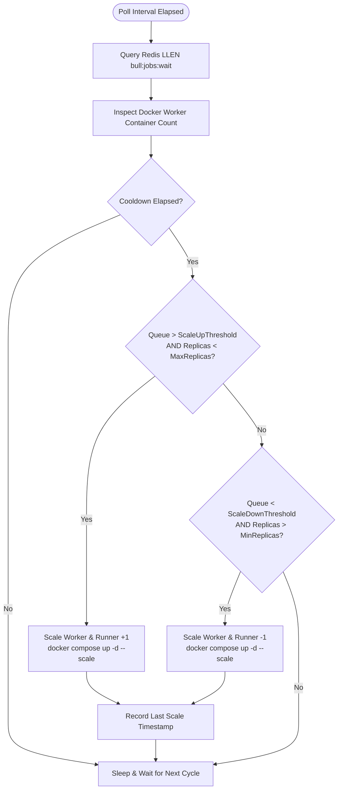

# Architecture — n8n Autoscaling Production Stack

This document expands on the high-level overview in the [README](../README.md) and explains every architectural decision in depth.

---

## Overview

The stack is composed of Docker containers that communicate exclusively over an isolated Docker bridge network (`n8n-net`). External access is limited to port `80` (n8n editor), and optionally `6333/6334` (Qdrant vector DB). The autoscaler monitors Redis queue depth and dynamically scales worker containers.

```
Browser / External
       │
       ▼
┌──────────────────────────────────────────────────────────┐
│                   n8n-net (bridge)                       │
│                                                          │
│  ┌──────────────────────────────────────────────────┐    │
│  │  n8n  (host port 80 → 5678)                      │    │
│  │  ─────────────────────────────────────────────── │    │
│  │  • Editor UI  (HTTP)                             │    │
│  │  • REST API   (/api/v1/*)                        │    │
│  │  • Task Broker (:5679 internal)                  │    │
│  │  • Enqueues executions → Redis                   │    │
│  └───────────────────────┬──────────────────────────┘    │
│                          │ Bull queue                    │
│  ┌───────────────────────▼──────────────────────────┐    │
│  │  n8n-webhook                                     │    │
│  │  • Dedicated webhook processor                   │    │
│  │  • Shares n8n_data volume with main              │    │
│  └──────────────────────────────────────────────────┘    │
│                          │                               │
│  ┌───────────────────────▼──────────────────────────┐    │
│  │  n8n-worker (autoscaled: 1–N replicas)           │    │
│  │  • Dequeues & runs workflow nodes                │    │
│  │  • Task Broker (:5679 internal)                  │    │
│  └───────────────────────┬──────────────────────────┘    │
│                          │ Task Runner Protocol          │
│  ┌───────────────────────▼──────────────────────────┐    │
│  │  n8n-worker-runner (autoscaled 1:1 with worker)  │    │
│  │  • JavaScript runner (Puppeteer, Playwright, AJV)│    │
│  │  • Python runner (pandas, numpy, pytz, etc)      │    │
│  │  • Chromium browser (headless)                   │    │
│  └──────────────────────────────────────────────────┘    │
│                                                          │
│  ┌──────────────────────────────────────────────────┐    │
│  │  n8n-autoscaler                                  │    │
│  │  • Polls bull:jobs:wait in Redis                 │    │
│  │  • Runs docker compose up --scale                │    │
│  │  • Scales worker + runner together (1:1)         │    │
│  └──────────────────────────────────────────────────┘    │
│                                                          │
│  ┌──────────────────────────────────────────────────┐    │
│  │  redis-monitor                                   │    │
│  │  • Logs queue depth every N seconds              │    │
│  └──────────────────────────────────────────────────┘    │
│                                                          │
│  ┌──────────────────────────────────────────────────┐    │
│  │  n8n-init (One-Shot)                             │    │
│  │  • Seeds DB credentials & WAHA community node    │    │
│  └──────────────────────────────────────────────────┘    │
│                                                          │
│  ┌──────────────────────────────────────────────────┐    │
│  │  mcp_server (Port 8000)                          │    │
│  │  • FastMCP AI Workflow Architect                 │    │
│  │  • Multi-Agent RAG, Dynamic Model Routing        │    │
│  └──────────────────────────────────────────────────┘    │
│                                                          │
│  ┌──────────────────────────────────────────────────┐    │
│  │  waha (port 3000)                                │    │
│  │  • WhatsApp HTTP API gateway                     │    │
│  │  • Volume: waha_sessions                         │    │
│  └──────────────────────────────────────────────────┘    │
│                                                          │
│  ┌────────────────┐  ┌────────────────┐                  │
│  │  PostgreSQL    │  │  Redis         │                  │
│  │  :5432 (int)   │  │  :6379 (int)   │                  │
│  └────────────────┘  └────────────────┘                  │
│                                                          │
│  ┌────────────────────────────────────┐                  │
│  │  Qdrant  :6333/:6334 (Vector DB)  │                  │
│  └────────────────────────────────────┘                  │
└──────────────────────────────────────────────────────────┘
```

---

## Service Deep-Dives

### n8n (Main Instance)

| Attribute | Value |
|---|---|
| Image | Custom — built from `Dockerfile` (Alpine multi-stage) |
| Exposed port | `80` (maps to internal `5678`) |
| Role | Editor UI, REST API, task broker |
| Queue mode | `EXECUTIONS_MODE=queue` |
| Memory Limit | `1024M` (prevent JS Heap OOM crashes) |

`n8n` runs in **queue mode** — it never directly executes workflow nodes. It enqueues execution jobs into Redis via the [Bull](https://github.com/OptimalBits/bull) library. All manual executions are offloaded to workers via `OFFLOAD_MANUAL_EXECUTIONS_TO_WORKERS=true`.

**Custom Dockerfile adds:** `ffmpeg`, `ffprobe`, `git`, `graphicsmagick`, `jq`, `curl` — installed via an Alpine builder stage and copied into the official `n8nio/n8n` image (which has `apk` stripped).

**Diagnostics suppressed:** `N8N_DIAGNOSTICS_ENABLED=false` eliminates the 6-second MCP registry timeout on startup.

**Health check:** `GET http://localhost:5678/healthz` — all dependent services wait for this before starting.

---

### n8n-webhook

| Attribute | Value |
|---|---|
| Image | Custom — built from `Dockerfile` |
| Command | `n8n webhook` |
| Role | Dedicated webhook processor — offloads webhook traffic from main instance |
| Memory Limit | `512M` |

The dedicated webhook processor handles all inbound `POST /webhook/*` and `GET /webhook/*` requests. This prevents webhook traffic from competing with the editor UI and REST API for resources on the main process. Shares the same `n8n-data` volume as the main instance.

---

### n8n-worker

| Attribute | Value |
|---|---|
| Image | Custom — built from `Dockerfile` |
| Command | `n8n worker` |
| Scalable | Yes — autoscaled by `n8n-autoscaler` |
| Runner mode | `N8N_RUNNERS_MODE=external` |
| Memory Limit | `1024M` |

Workers are **stateless** — they share no disk state with each other. All state lives in PostgreSQL (workflow definitions, credentials) and Redis (queue, locks).

**No static `container_name`** — required for the autoscaler to scale this service dynamically. The autoscaler identifies containers by the `com.docker.compose.service` and `com.docker.compose.project` Docker labels.

Each worker runs its own Task Broker on `0.0.0.0:5679` (`N8N_RUNNERS_BROKER_LISTEN_ADDRESS=0.0.0.0`) so its paired `n8n-worker-runner` sidecar can connect to it.

---

### n8n-worker-runner

| Attribute | Value |
|---|---|
| Image | Custom — built from `Dockerfile.runner` (Alpine multi-stage) |
| Base | `n8nio/runners:latest` |
| Broker URI | `http://n8n-worker:5679` |
| Scaled | 1:1 with `n8n-worker` by the autoscaler |

This is the **task runner sidecar** introduced in n8n 2.0. Each worker must have exactly one paired runner. The autoscaler scales both in a single `docker compose up --scale` command to maintain the 1:1 ratio.

**JavaScript packages pre-installed via pnpm:**
- `puppeteer-core@22.15.0`, `puppeteer-extra`, `puppeteer-extra-plugin-stealth`
- `playwright-core`, `playwright-extra`
- `ajv`, `ajv-formats`

**Python packages pre-installed via uv:**
- `requests`, `pillow`, `pandas`, `numpy`

**System tools (copied from Alpine builder):**
- `chromium-browser` — headless browser for Puppeteer/Playwright
- `ffmpeg`/`ffprobe`, `git`, `graphicsmagick`, `imagemagick`

**Security note:** `NODE_ENV=test` is set in the runner to disable prototype freezing, which is required for Puppeteer/Playwright to work. The `n8n-task-runners.json` config removes `--disable-proto=delete` for this reason.

---

### n8n-autoscaler

| Attribute | Value |
|---|---|
| Image | Custom — built from `autoscaler/Dockerfile` (Python 3.12) |
| Volume | `/var/run/docker.sock` — Docker socket |
| Script | `autoscaler/autoscaler.py` |

The autoscaler is a Python process that:

1. Connects to Redis and polls `bull:jobs:wait` every `POLLING_INTERVAL_SECONDS`
2. Counts running `n8n-worker` containers using the Docker SDK (filtered by Compose project + service labels)
3. Scales **up** when `queue_length > SCALE_UP_QUEUE_THRESHOLD` and `replicas < MAX_REPLICAS`
4. Scales **down** when `queue_length < SCALE_DOWN_QUEUE_THRESHOLD` and `replicas > MIN_REPLICAS`
5. Respects a `COOLDOWN_PERIOD_SECONDS` between any scaling action
6. Scales worker AND runner together in one atomic `docker compose up --scale` command

**Scaling command used:**
```bash
docker compose -f /app/docker-compose.yml -p <COMPOSE_PROJECT_NAME> \
  up -d --no-deps \
  --scale n8n-worker=N \
  --scale n8n-worker-runner=N \
  n8n-worker n8n-worker-runner
```

---

### redis-monitor

| Attribute | Value |
|---|---|
| Image | Custom — built from `monitor/monitor.Dockerfile` (Python 3.12-slim) |
| Script | `monitor/monitor_redis_queue.py` |
| User | Non-root (`monitor` user, UID 1000) |

A lightweight Python service that polls Redis for queue depth every `POLL_INTERVAL_SECONDS` and logs it. Uses event-driven logging — only logs when queue has items, or when queue drains to zero (transition event). Silent at idle.

---

### n8n-init (Credential Provisioner)

| Attribute | Value |
|---|---|
| Image | `docker.n8n.io/n8nio/n8n:latest` |
| Command | `node /scripts/provision.js` |
| Role | One-shot execution — exits after completion |
| Restart | `"no"` |

Runs briefly at stack startup to idempotently seed credentials into PostgreSQL using the n8n CLI. Never overwrites existing credentials. Exits cleanly after completion.

---

### waha (WhatsApp HTTP API)

| Attribute | Value |
|---|---|
| Image | `devlikeapro/waha:latest` |
| Exposed port | `3000` |
| Role | WhatsApp HTTP API gateway |
| Data volume | Named Docker volume `waha_sessions` |

The `waha` container provides a WhatsApp HTTP API gateway, running locally and exposing a REST API on port `3000` inside the `n8n-net` network.

**Community Node**: The `n8n-init` service automatically checks for and installs the `@devlikeapro/n8n-nodes-waha` node in the n8n community nodes directory (`/home/node/.n8n/nodes`), enabling a native graphical user interface in the n8n editor.

**Credentials**: Seeding is handled automatically on startup by the `n8n-init` service:
- Credentials Name: `WAHA API — n8n Stack`
- Type: `wahaApi`
- API Key: `admin` (or custom from `WAHA_API_KEY`)
- API URL: `http://waha:3000` (resolves internally via Docker DNS)

**Session Persistence**: All active WhatsApp sessions (QR codes, credentials, and message states) are persisted inside the named Docker volume `waha_sessions`.

---

### PostgreSQL

| Attribute | Value |
|---|---|
| Image | `postgres:16-alpine` |
| Internal port | `5432` |
| Memory Limit | `512M` |
| Data volume | Named Docker volume `postgres_data` |

Stores all n8n application data. Never exposed to the host network.

#### Production Tuning

| Parameter | Value | Effect |
|---|---|---|
| `shared_buffers` | `128MB` | Main read cache — tuned for 7.6 GB RAM host |
| `effective_cache_size` | `384MB` | Planner hint for index preference |
| `work_mem` | `8MB` | Per-sort/hash memory — prevents memory exhaustion |
| `maintenance_work_mem` | `64MB` | Speeds VACUUM, CREATE INDEX |
| `checkpoint_completion_target` | `0.9` | Spreads checkpoint I/O — eliminates spikes |
| `wal_buffers` | `8MB` | Reduces WAL write round-trips |
| `max_wal_size` | `512MB` | Allows more WAL before triggering a checkpoint |
| `min_wal_size` | `80MB` | Minimum WAL size |
| `synchronous_commit` | `off` | Sub-ms COMMIT latency on Docker Desktop/Windows |
| `fsync` | `on` | Enabled for data safety (re-enabled for crash protection) |
| `full_page_writes` | `on` | Enabled for data safety (re-enabled for crash protection) |
| `log_min_duration_statement` | `2000ms` | Logs queries slower than 2 seconds |

#### Connection Tuning (Application-side)

To prevent database connection timeouts during startup (especially on resource-constrained environments or hosts with high disk I/O latency like Docker Desktop on Windows), connection pooling and timeout variables are configured in the `x-n8n` container template:

- `DB_POSTGRESDB_POOL_SIZE` = `10`: Increases the parallel open connections from the default `2` to `10` to handle queue mode worker loads.
- `DB_POSTGRESDB_CONNECTION_TIMEOUT` = `60000` (60 seconds): Extends the connection timeout from the default `20` seconds to prevent timeouts during simultaneous multi-container startups.

---

### Redis (Bull Queue Broker)

| Attribute | Value |
|---|---|
| Image | `redis:7-alpine` |
| Internal port | `6379` |
| Data volume | Named Docker volume `redis_data` |
| Config file | `./redis.conf` (mounted read-only) |
| Auth | Unauthenticated (internal network only) |
| Memory Limit | `128M` |

Acts as the **Bull queue broker** coordinating jobs between the main server, webhook processor, and worker pool. Redis is strictly accessible inside `n8n-net` and never published to the host network.

#### Broker Durability & Crash Resilience Engine

The broker is configured for high throughput combined with crash-safe transaction durability:

1. **AOF + RDB Hybrid Persistence (`appendonly yes`, `aof-use-rdb-preamble yes`)**:
   - Every mutating Redis command is logged to the Append-Only File with `appendfsync everysec`.
   - The RDB preamble combines the point-in-time snapshot speed of RDB with the transaction granularity of AOF, dramatically reducing container startup and restart recovery times.

2. **Automated Crash Self-Healing (`aof-load-truncated yes`)**:
   - In containerized production environments, ungraceful container terminations (e.g. host reboots, OOM kills, power interruptions) can truncate the trailing bytes of the active `.incr.aof` file.
   - Enabling `aof-load-truncated yes` instructs Redis to safely discard corrupt or partial trailing bytes upon startup, log a warning, and initialize immediately, preventing infinite crash-restart loops.

3. **Memory Ceiling Protection**:
   - Configured with `maxmemory 96mb` and `maxmemory-policy allkeys-lru` to guarantee that unexpected queue spikes never cause container OOM kills.

---

### Qdrant (Vector Database)

| Attribute | Value |
|---|---|
| Image | `qdrant/qdrant:latest` |
| Ports | `6333` (REST), `6334` (gRPC) |
| Data volume | Named Docker volume `qdrant_storage` |

High-performance vector database for RAG and embedding storage. n8n vector store nodes connect via `http://qdrant:6333`.

---

## Startup Ordering & Health Checks

Docker Compose `depends_on` with `condition: service_healthy` enforces strict ordering:

```
postgres ──(healthy, 30s start_period)──┐
                                        ├──► n8n ──(healthy, 60s)──► n8n-webhook
redis    ──(healthy, 10s start_period)──┘                       ├──► n8n-worker ──► n8n-worker-runner
                                                                ├──► n8n-autoscaler
                                                                └──► n8n-init
```

All services include `restart: unless-stopped` so the stack recovers automatically after host reboots.

### Shutdown Grace Periods

| Service | `stop_grace_period` | Reason |
|---|---|---|
| `postgres` | `60s` | Completes shutdown checkpoint + WAL flush |
| `redis` | `20s` | Flushes AOF buffer to disk |
| `n8n` | `30s` | Finishes in-flight HTTP requests |
| `n8n-worker` | `5m` | Completes any currently-executing workflow |

---

## Network Isolation

All services share `n8n-net` (Docker bridge). Services resolve each other by container name (e.g., `postgres`, `redis`, `n8n`). Only `n8n:80` and `qdrant:6333/6334` are published externally.

---

## Security Considerations

| Concern | Mitigation |
|---|---|
| Secrets in version control | `.env` is `.gitignore`d; `.env.example` contains only placeholders |
| Runner auth | `N8N_RUNNERS_AUTH_TOKEN` shared secret prevents rogue runner connections |
| Database exposure | PostgreSQL and Redis not published to host |
| Code execution sandbox | Task runners run as a separate process/container, isolated from main n8n |
| Encryption at rest | Credentials AES-256-CBC encrypted with `N8N_ENCRYPTION_KEY` |
| Redis unauthenticated | Acceptable — Redis is network-isolated inside `n8n-net` only |
| Autoscaler Docker socket | Required for `docker compose` — grants container management rights |

---

## Data Flow: Workflow Execution

```mermaid
sequenceDiagram
    autonumber
    actor Client as External Client / Webhook
    participant Webhook as n8n-webhook (:5678)
    participant Redis as Redis BullMQ (:6379)
    participant Autoscaler as n8n-autoscaler (Docker API)
    participant Worker as n8n-worker (:5679)
    participant Runner as n8n-worker-runner
    participant Postgres as PostgreSQL (:5432)

    Client->>Webhook: POST /webhook/process-order
    Webhook->>Redis: Enqueue Job (bull:jobs:wait)
    Webhook-->>Client: 200 OK (Execution Queued)

    par Autoscaling Loop
        Autoscaler->>Redis: Poll LLEN bull:jobs:wait
        alt Queue Length > SCALE_UP_THRESHOLD
            Autoscaler->>Autoscaler: Trigger scale up (worker=N, runner=N)
        end
    end

    Redis->>Worker: Dequeue Job (BRPOPLPUSH)
    Worker->>Postgres: Record status = 'running'
    
    rect rgb(30, 41, 59)
        Note over Worker,Runner: Isolated Code Node Delegation
        Worker->>Runner: Submit JS/Python Task (WebSocket IPC :5679)
        Runner->>Runner: Execute sandbox (Chromium / Pandas / UV)
        Runner-->>Worker: Stream Execution Output & Artifacts
    end

    Worker->>Postgres: Persist Execution Result & State ('success'/'error')
    Worker->>Redis: Acknowledge & Remove Job (bull:jobs:active -> completed)
```



### Autoscaler Decision Engine Loop



```
1. User triggers workflow    →  n8n receives trigger (or n8n-webhook for HTTP)
2. n8n enqueues job          →  Redis (Bull queue: bull:jobs:wait)
3. n8n-autoscaler polls      →  sees queue length, may scale n8n-worker up
4. n8n-worker dequeues job   →  executes non-code nodes locally
5. Worker hits Code node     →  submits task to its task broker (:5679)
6. Broker dispatches task    →  n8n-worker-runner (connected via WebSocket)
7. Runner executes code      →  Chromium / Python / JS sandbox
8. Runner streams result     →  back to worker's broker
9. Worker continues workflow →  writes result to PostgreSQL
10. Autoscaler polls again   →  may scale down if queue empty
```

---

## Data Persistence

| Data | Storage | Survives `docker compose down`? |
|---|---|---|
| Workflows, credentials, variables | `postgres_data` Docker volume | ✅ Yes |
| Execution history | `postgres_data` Docker volume | ✅ Yes |
| n8n user files & config | `./n8n-data` bind mount | ✅ Yes |
| Redis queue state | `redis_data` Docker volume | ✅ Yes |
| Vector embeddings | `qdrant_storage` Docker volume | ✅ Yes |
| WhatsApp Sessions | `waha_sessions` Docker volume | ✅ Yes |
| Backups | `backup_data` volume + `./backups/` | ✅ Yes |

> ⚠️ `docker compose down -v` destroys all named volumes — **this is irreversible**.

---

## Operational & Diagnostic Scripts

A collection of PowerShell, Python, and SQL scripts reside in the `scripts/` directory to help manage and diagnose the stack:

1. **Workflow Parsing and Configuration Modification:**
   - **[parse_nodes.py](file:///d:/courses/Data%20Science/Data%20Engineering/n8n/scripts/parse_nodes.py)**: Scans raw workflow export JSON and reports details of Ollama nodes.
   - **[modify_workflow.py](file:///d:/courses/Data%20Science/Data%20Engineering/n8n/scripts/modify_workflow.py)**: Automatically modifies context window sizes (`numCtx` option to `2048`) and updates the model to `qwen2.5:1.5b` for Ollama chat nodes to ensure stable executions on limited-VRAM hosts.

2. **Database Diagnostics & Space Reclamation:**
   - **[cleanup.sql](file:///d:/courses/Data%20Science/Data%20Engineering/n8n/scripts/cleanup.sql)**: Prunes execution logs older than 3 days, marks orphaned running tasks as `crashed`, and runs `VACUUM FULL` to reclaim space.
   - **[count_chat.sql](file:///d:/courses/Data%20Science/Data%20Engineering/n8n/scripts/count_chat.sql)**: Counts total messages in chat history tables grouped by session.
   - **[durations.sql](file:///d:/courses/Data%20Science/Data%20Engineering/n8n/scripts/durations.sql)** & **[durations_times.sql](file:///d:/courses/Data%20Science/Data%20Engineering/n8n/scripts/durations_times.sql)**: Reports workflow execution duration patterns to identify slow nodes or bottlenecks.
   - **[get_error.sql](file:///d:/courses/Data%20Science/Data%20Engineering/n8n/scripts/get_error.sql)** & **[search_errors.sql](file:///d:/courses/Data%20Science/Data%20Engineering/n8n/scripts/search_errors.sql)**: Pinpoints errors and exceptions recorded within execution records.
   - **[get_keys.sql](file:///d:/courses/Data%20Science/Data%20Engineering/n8n/scripts/get_keys.sql)**: Helper to inspect JSON properties of execution records.

### mcp_server (n8n AI Workflow Architect)

| Attribute | Value |
|---|---|
| Implementation | `mcp_server/server.py` & `llm_generator.py` |
| Exposed port | `8000` |
| Role | Generates workflows, reads n8n docs, discovers AI models |

A FastMCP backend written in Python that provides a web-based Chat UI for AI-driven n8n workflow generation. It leverages a Multi-Agent RAG system to read n8n documentation and templates, automatically discovering available LLM models from existing workflows. It includes a built-in visual diff engine and direct 1-click exporting to the n8n REST API.

---

## Enterprise Stack Extensions Architecture

For enterprise production deployments requiring carrier-grade reliability, compliance, and multi-tenant observability, the following architectural modules can be integrated directly into this stack:

### 1. Prometheus & Grafana Telemetry Layer

```
┌─────────────────┐       ┌─────────────────┐       ┌─────────────────┐
│   n8n /metrics  ├──────►│   Prometheus    ├──────►│     Grafana     │
│   (Process,     │       │   Scraper       │       │   Dashboards    │
│    Event Loop)  │       │   (15s interval)│       │   (SLO Alerts)  │
└─────────────────┘       └─────────────────┘       └─────────────────┘
         ▲
         │ (Redis Queue Metrics)
┌─────────────────┐
│  redis-monitor  │
│  Exporter       │
└─────────────────┘
```

- **Scrape Target**: `n8n-main-server:5678/metrics` exposes standard Prometheus metrics (Node.js heap size, garbage collection cycles, active event loop lag, and HTTP latency).
- **Queue Saturation Monitoring**: Ingests BullMQ queue metrics (`bull:jobs:wait`, `bull:jobs:active`, `bull:jobs:failed`) to trigger automated alerts when queue latency exceeds 30 seconds.
- **Pre-configured Dashboards**: Community dashboard (Grafana ID `24474` - *n8n System Health Overview*) provides instant out-of-the-box visibility into runtime bottlenecks.

### 2. Distributed Tracing (OpenTelemetry / OTel)

```
[ Inbound Webhook HTTP ] ──► (Generates W3C Traceparent Header)
                                     │
                                     ▼
                            [ BullMQ Queue Job ] ──► (Propagates Span ID in Job Payload)
                                     │
                                     ▼
                            [ Worker Node Execution ] ──► (Traces Node Execution Spans)
                                     │
                                     ▼
                            [ OpenTelemetry Collector ] ──► Jaeger / Honeycomb / Datadog
```

- **Span Context Propagation**: Injects W3C `traceparent` headers into Redis BullMQ job metadata so that end-to-end execution spans remain continuous across asynchronous process boundaries.
- **Latency Attribution**: Isolates whether delays stem from queue wait time, database lock contention, or third-party API throttling (e.g. OpenAI / Google Drive rate limits).

### 3. Edge Reverse Proxy & Rate Limiting (Traefik v3)

- **Dynamic Container Discovery**: Traefik inspects Docker labels dynamically to configure routes, eliminating manual config reloads when workers autoscale.
- **Path-Based Traffic Segregation**:
  - Route `/webhook/*` and `/webhook-test/*` directly to `n8n-webhook` containers.
  - Route `/` and `/rest/*` to `n8n-main-server` with IP allowlisting or Basic Auth middleware.
- **Automated SSL/TLS**: Native ACME integration with Let's Encrypt for automatic wildcard certificate generation and zero-downtime renewals.

### 4. Database Connection Pooling (PgBouncer)

- **Problem**: When `n8n-worker` autoscales from 1 to 5+ replicas, each worker process opens up to 10 connections (`DB_POSTGRESDB_POOL_SIZE=10`), potentially exhausting PostgreSQL's `max_connections` ceiling.
- **Architecture**: Placing PgBouncer in front of PostgreSQL in `transaction` pooling mode allows hundreds of worker threads to share a persistent pool of 10–20 server connections, eliminating connection spikes and lowering PostgreSQL memory footprint.

### 5. Secrets Management (HashiCorp Vault / Infisical)

- **Decoupled Secrets**: Eliminates raw `.env` files on disk. Containers authenticate with Vault using Docker AppRole or cloud IAM.
- **Dynamic Credentials**: PostgreSQL database passwords and API tokens are leased dynamically with TTLs and rotated automatically, adhering to SOC2 and ISO27001 data security standards.
