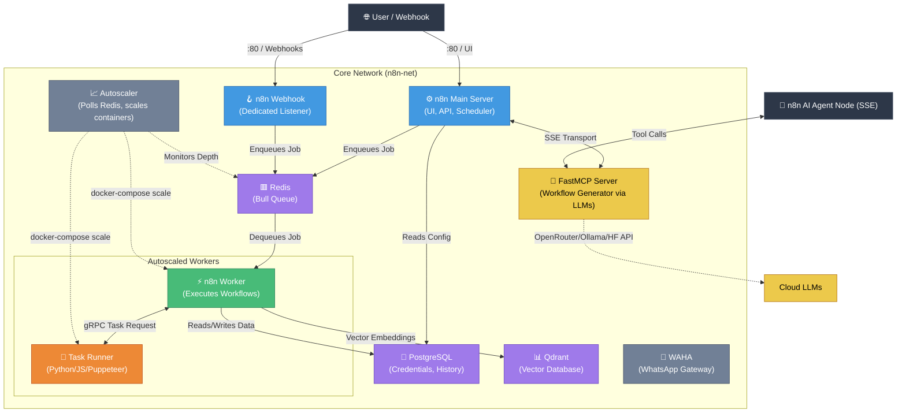

# Infrastructure Blueprint — n8n Autoscaling Production Stack

A clean, modern architecture diagram of the self-hosted **n8n Autoscaling Production Stack**, updated for n8n 2.0 with external task runners, dynamic worker autoscaling, browser automation support, and the **FastMCP Workflow Generator**.

## Diagram

### Mermaid Architecture

### Modern Vector (SVG) Format
The SVG version supports infinite scaling and crisp lines. Open it directly in your browser:
🔗 **[infographic.svg](./infographic.svg)**

### Image (PNG) Format
High-resolution PNG suitable for presentation slides and documentation:
🔗 **[infographic.png](./infographic.png)**

---

## Architecture Flow Overview

1. **Client / External Access**: Web browsers and external services access `n8n` through port `80`. Dedicated webhooks are handled by `n8n-webhook`.

2. **n8n (Main)**: Handles the editor UI, REST API, manual triggers, and scheduling. Enqueues workflow executions into the Redis Bull queue. All manual executions are offloaded to workers via `OFFLOAD_MANUAL_EXECUTIONS_TO_WORKERS=true`.

3. **n8n-webhook**: A dedicated process for inbound webhook traffic — isolates webhook load from the editor UI.

4. **Redis (Queue Broker)**: Holds executing workflow tasks in the `bull:jobs:*` queue. Unauthenticated and network-isolated inside `n8n-net`.

5. **n8n-worker (Autoscaled)**: Stateless replicas that pull jobs from Redis, execute workflow logic, and write results to PostgreSQL. No static container name — dynamically scaled by the autoscaler.

6. **n8n-worker-runner (Autoscaled 1:1)**: External task runner sidecar for each worker (n8n 2.0 requirement). Executes JavaScript (with Puppeteer, Playwright, stealth) and Python (pandas, numpy, pytz, dateutil, etc) code in an isolated container. Chromium browser built-in.

7. **n8n-autoscaler**: Python service that polls `bull:jobs:wait` in Redis and issues `docker compose up --scale` commands to scale workers and runners up or down together. Configurable thresholds, cooldown, and min/max limits.

8. **redis-monitor**: Lightweight Python service that continuously logs Redis queue depth. Event-driven — only logs when queue has items or transitions to zero.

9. **PostgreSQL**: Persistent storage for workflow definitions, credentials (AES-256 encrypted), execution history, and user accounts.

10. **Qdrant (Vector DB)**: High-performance vector database for RAG-based workflows and embedding storage. Accessible via `http://qdrant:6333` inside the network.

11. **FastMCP Server (n8n AI Workflow Architect)**: Advanced AI-driven backend for natural language workflow generation. Connects to n8n via Server-Sent Events (SSE) and securely routes LLM API calls. Features Multi-Agent RAG for reading n8n docs, dynamic local model discovery, template generation, and 1-click exporting to n8n.

12. **n8n-init (One-Shot)**: Runs briefly on first startup to seed credentials into PostgreSQL from `.env` and automatically install the `@devlikeapro/n8n-nodes-waha` community node, then exits. Never overwrites existing data.

13. **waha**: WhatsApp HTTP API gateway running locally on port `3000`. Handled inside the network using the auto-installed WAHA community node. Session files are persisted in the `waha_sessions` volume.

14. **n8n-backup (Optional)**: Profile-gated backup service (`docker compose --profile backup up -d`). Runs scheduled `pg_dump` + Redis RDB + volume archive → GPG encryption → rclone cloud upload.

15. **Diagnostics & Maintenance Scripts**: A collection of helper tools (located in the `scripts/` directory) for automated workflow/docs sync (`auto_sync.ps1`), database pruning and space reclamation (`cleanup.sql`), performance and error diagnostics (`durations.sql`, `get_error.sql`), and workflow configuration automation (`modify_workflow.py`).
