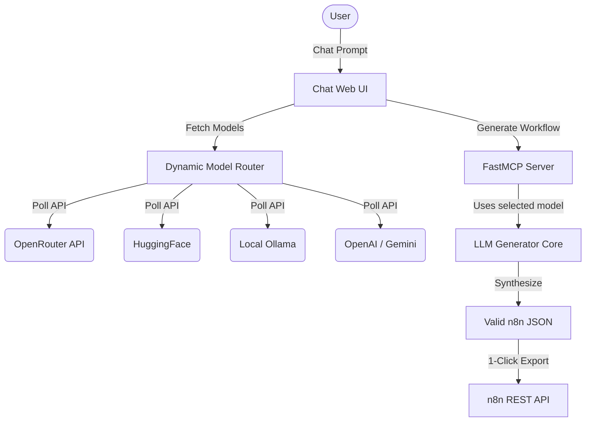

# n8n AI Workflow Architect (MCP Server)

A FastMCP-based Server-Sent Events (SSE) server and standalone **ChatGPT-style Web Application** that allows you to automatically generate n8n workflows from natural language prompts using LLMs.

## Features

- **Conversational AI Agent**: The root URL serves a complete ChatGPT-like interface where you can chat interactively to design, discuss, and refine your workflows.
- **Multi-Provider Dynamic Model Routing**: The UI dynamically polls available models across all your integrated APIs:
  - **OpenRouter** (All 300+ models fetched dynamically)
  - **HuggingFace Serverless** (Defaults to `openai/gpt-oss-120b`)
  - **Ollama Local** (Auto-detects installed models via `/api/tags`)
  - **OpenAI-Compatible Endpoints** (AgentRouter, HF Router)
  - **Google Gemini** (Antigravity models)
- **Automatic Credentials Syncing**: Integrates seamlessly with your n8n environment to decrypt and load your `OpenAiApi`, `OpenRouterApi`, and `HuggingFaceApi` credentials stored within n8n.
- **Persistent SQLite Database**: Your chat sessions, messages, and generated JSON workflows are securely stored in a local SQLite database (`chat_history.db`).
- **Self-Healing AI Loop**: The backend validates the generated n8n JSON schema. If the AI makes a syntax error, the backend automatically triggers a hidden retry loop to force the AI to fix its mistake.
- **1-Click n8n Export**: The web UI connects directly to your n8n instance via the REST API to automatically push generated workflows.
- **Dockerized Ready**: Comes with a `Dockerfile` and `docker-compose.yml` for instant production deployment alongside your n8n stack.

## System Architecture



## Running the Server

Make sure you have installed the dependencies:

```bash
pip install -r requirements.txt
```

Start the server:

```bash
python build_server.py  # Compiles dynamic routes into server.py
python server.py
```

The server will be available at `http://localhost:8000`. If you visit this in your browser, you'll be greeted by the AI Chat Interface!

## Using the Chat Interface

1. Open `http://localhost:8000` in your web browser.
2. The Model dropdown will automatically populate with all available models from your API keys.
3. Click **n8n Settings** in the bottom-left corner to set your **n8n Host URL** and **n8n API Key**.
4. Describe your workflow in the chat. When the AI generates the JSON, click **Export to n8n** to instantly deploy it!

## Connecting to n8n via MCP (Optional)

If you still want to use the MCP Server directly inside an n8n workflow using the "Model Context Protocol" Tool node:

1. In the n8n workflow canvas, add an **MCP Tool** node.
2. Set the Transport type to **SSE**.
3. Set the URL to:
   ```
   http://host.docker.internal:8000/mcp/sse
   ```
   *(Important: Ensure you include the `/mcp/sse` path!)*

## Environment Variables

Ensure the `mcp_server/.env` file contains at least one of the following:
- `OPENROUTER_API_KEY` (Recommended for complex workflows)
- `HUGGINGFACE_API_TOKEN`
- `OLLAMA_HOST` (e.g. `host.docker.internal:11434`)
- `GEMINI_API_KEY`
- `AGENTROUTER_API_KEY` & `AGENTROUTER_URL`
